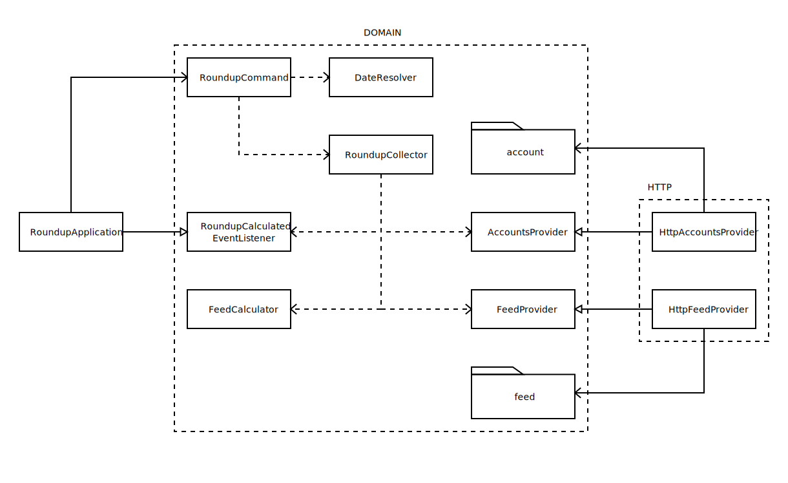

# The Roundup Challenge

Hello Starling Bank,

My name is Lukas Normantas, I would like to present this repo
as my response to tech challenge, for Java position at
Starling Bank.

## Scope
Due to the time limitation I need to reduce the scope.
The solution will not have functionality to
create saving goals.
Saving goals would require to make calls to Starling Bank API
that include request body, which has to be signed and adds more
complexity.
Java microservice will be just a CLI Application,
which only calculates roundup for all transactions in given week.

## Ways of working and Technology

### Test Driven Development

Write code in these phases:
- introduce a failing test;
- write as little code as possible to pass that test
- refactor,- it should not change functionality, just structure of the code.

I am committing each phase to git. I will mark commits using icons:

|icon | meaning |
|---|---|
| 🍎 | Adding failing test |
| 🍏 | Making test pass |
| ♻️ | Refactorings |

Please check the commit log.

### Self sustained Monorepo

To facilitate microservices architecture, I will use monorepo-for-domain pattern.
If there will be more Java projects - they will be added as maven modules in separate repos. This setup also supports polyglot technologies.

Docker is used as a build tool.

Docker Compose is used as Development Environment setup.
It should model self sustained monorepo, which includes:

- Java microservice, in roundup directory;
- Stub of Starling Bank API, to facilitate local development and manual testing;

Most common development commands are defined in Makefile

### Java

I use Java 11, Spring Boot bootstrapped from https://start.spring.io/
with Maven. But I run it all inside docker container.

### Building and running

Once files checked from git please run:

    make build

This will build the jar file and run the tests.
It requires Docker Compose to run.

To start stubbed Starling API run:

    make up-stub
    source <(make env)

Now we can run the application itself:

    java -jar ./roundup/target/roundup-0.0.1-SNAPSHOT.jar 2020 12

To run it against actual sandbox API we need to change these environment variables:

    export ROUNDUP_STARLING_HOST=https://api-sandbox.starlingbank.com
    export ROUNDUP_ACCESS_TOKEN=< your sandbox application access token >
